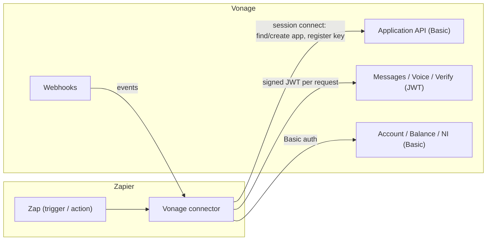

# Vonage connector for Zapier

A [Zapier Platform](https://platform.zapier.com) (CLI) integration for [Vonage](https://www.vonage.com). It lets a Zapier maker send messages across channels (SMS, WhatsApp, RCS, Viber, MMS, Messenger, Instagram), place voice calls, run Verify (2FA) flows, look up account balance and Number Insight, and **receive** inbound messages, delivery receipts, and voice/verify events through native REST-hook triggers.

The maker enters only a Vonage **API key and secret**. The Vonage Application that backs the JWT-authenticated APIs (Messages, Voice, Verify), its signing keys, and all the webhook plumbing are created and managed for them — they never see an Application ID or a private key.

---

## Why this exists

The Vonage surface a low-code maker wants — "when I get a WhatsApp message, do X"; "send an RCS card"; "verify this number" — spans several Vonage APIs with two different auth schemes (Basic for account-level reads, a signed JWT for Messages/Voice/Verify) and requires an underlying Vonage *Application* with correctly wired webhooks. Exposing that raw to a Zapier maker would mean asking them to create an Application, generate a keypair, register it, and paste webhook URLs by hand.

This connector hides all of it behind **session auth**: connecting a Vonage account provisions and maintains the Application transparently. The result is a connector where every trigger and action Just Works from an API key and secret.

## Architecture in one picture

Unlike the [Power Automate sibling](https://github.com/aficcion/vonage-pa-trigger) — which needs an external middleware because Power Automate connectors are declarative and can't run code — the Zapier Platform **runs JavaScript** at every stage of a request (`sessionConfig`, `beforeRequest`, `afterResponse`). So this connector is **self-contained**: the same application/key/JWT management lives inside the connector itself, with no external service.



## Capabilities

| Kind | Items |
|------|-------|
| **Triggers** | Inbound message, Message status, Inbound call, Call status, Verify event (+ dynamic dropdowns: list numbers, list senders) |
| **Actions** | Send SMS, Send message (multi-channel), Make call, Send/Check/Cancel verification |
| **Searches** | Number Insight, Get account balance |

See **[docs/reference.md](docs/reference.md)** for the full list.

## Documentation

- **[Architecture](docs/architecture.md)** — session auth, the managed Vonage Application, key/JWT signing, self-healing, and webhook hygiene.
- **[Reference](docs/reference.md)** — every trigger, action and search.
- **[Engineering handoff](docs/handoff-to-engineering.md)** — productionization checklist and the gotchas to know before shipping.

## Development

```bash
npm install
npx zapier test          # run the test suite
npx zapier validate      # platform validation
npx zapier push          # push a new version to the private app
```

The integration is built on `zapier-platform-core` 19. App definition entry point is `index.js`.

| Path | What it is |
|------|------------|
| `index.js` | App definition: wires triggers, actions, searches, auth and middleware. |
| `authentication.js` | Session auth: provisions and maintains the managed `Zapier` Vonage Application. |
| `jwt_middleware.js` | `beforeRequest`/`afterResponse`: signs the JWT and self-heals on a stale key. |
| `app_webhooks.js` | Subscribe/unsubscribe plumbing for the Vonage Application webhooks. |
| `phone.js` | Phone-number normalisation. |
| `triggers/`, `creates/`, `searches/` | One file per trigger, action and search. |
| `notes/` | Internal working notes and demo assets. Local only — not tracked. |
