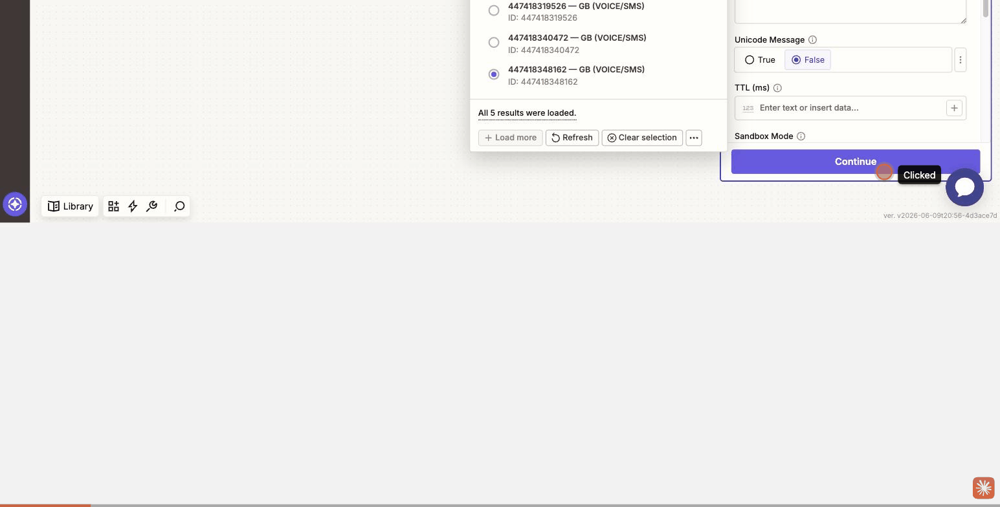
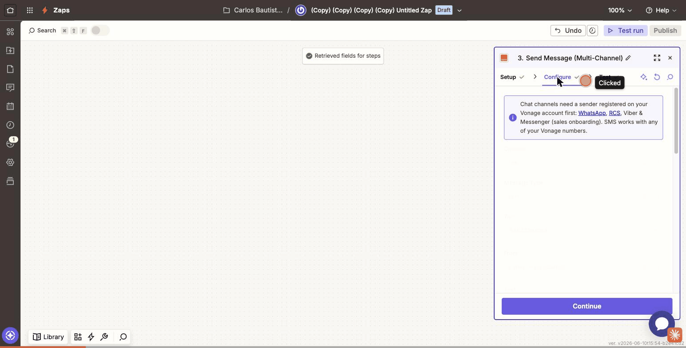
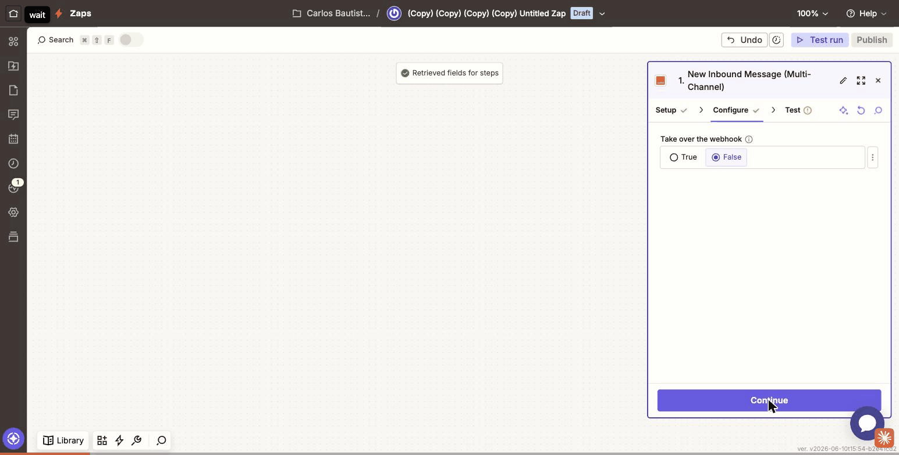

# Vonage Connector for Zapier — Demo (v1.1)

Demo gallery for the Vonage connector on Zapier (private app **App241564**,
version **1.1.0**). The design goal: the user describes **what** to send and
**over which channel**; the connector silently resolves **who signs** the
request and **where** events are delivered.

> Everything below is validated end-to-end in the real Zapier editor. Test
> handset: `+34622293256`.

---

## In 30 seconds

One connector covering Vonage's full messaging lifecycle — send & receive SMS,
multi-channel messages (RCS, WhatsApp, Viber, Messenger), voice calls, 2FA
verification and Number Insight — with a connection that asks for **API key +
secret only**. The Vonage application, the JWT signing and the webhook
registration are all invisible and automatic.

---

## Connection — key + secret only

The connection (session auth) asks for two fields:

| Field | |
|---|---|
| API Key | `f1d1ed0b` |
| API Secret | (hidden) |

On connect, the connector silently finds-or-creates a managed "Zapier"
application, generates an RSA key pair, registers the public key, and signs
every request from the session. If the key is rotated or broken externally, the
next call gets a `401`, the connector re-runs the exchange and retries — no user
action (self-healing, validated by breaking the key on purpose).

---

## Action — Send SMS (Messages API)

The **From field is a dropdown** of the account's real Vonage numbers (you can
also type a number or an alphanumeric sender ID). The send goes through the
**Messages API** and returns a `Message Uuid`. The managed JWT signs SMS from
any sender, so there is never a "that number isn't yours" error.

---

## Action — Send RCS (multi-channel)

Send Message (Multi-Channel) on the **RCS** channel, From = the registered RCS
agent `carlos`. A guided empty-state banner links to sender onboarding for chat
channels. Returns a `Message Uuid`; the RCS lands on the handset.

> RCS (and other chat channels) require the sender's RCS agent to be linked to
> the connector's managed application. Agent `carlos` was linked to it for this;
> from then on RCS is native to the connector.

---

## Action — Make Outbound Call (Voice)

Make Outbound Call with text-to-speech (here `en-GB`). The connector signs with
the managed application JWT and returns the call `Uuid` and `started` status;
the handset rings and reads the message.

---

## Trigger — New Inbound Message (RCS)

The **New Inbound Message** trigger registers its webhook on the managed
application automatically when the Zap turns on (with the "Take over the
webhook" guard from below). The pulled record shows a real inbound message with
**Channel: rcs** — From, To, Message Type, Text, Timestamp.

---

## Full catalogue

Every action/search below is validated against the live Vonage API. The four
pieces above ship as animated clips; the rest are listed with their real output
(clips available on request).

### Actions & search

| Piece | What it does | Key output |
|---|---|---|
| Send SMS | SMS via Messages API | `messageId` / `messageUuid` |
| Send Message (Multi-Channel) | SMS, RCS, WhatsApp, MMS, Viber, Messenger | `messageUuid` |
| Make Outbound Call | Voice call with TTS / audio / record / forward | `uuid`, `status` |
| Send Verification Code (2FA) | Start a Verify v2 workflow | `request_id` |
| Check Verification Code | Submit the PIN to complete a verification | `status` |
| Cancel Verification Request | Cancel an in-progress verification | `cancelled` |
| Number Insight (search) | Carrier / country / type / ported lookup | carrier, country, ported |

### Triggers

All triggers register their Vonage webhook automatically when the Zap turns on,
protect a foreign URL ("warn, don't clobber" — opt-in "Take over the webhook"),
and restore the previous URL when the Zap turns off.

| Trigger | Fires on | Channel-aware |
|---|---|---|
| New Inbound SMS | SMS to your numbers | SMS |
| New Inbound Message | Inbound message on any channel | **RCS**, WhatsApp, Viber, Messenger, SMS |
| New Inbound Call | Incoming call | Voice |
| Call Status Changed | Call status (completed, failed…) | Voice |
| Message Status Updated | Message receipt (delivered, read…) | all Messages API |
| Verify Event (2FA) | Verification event | Verify |
| Delivery Receipt Received | Account-level delivery receipt | SMS |

### Sandbox & guards

- **Sandbox Mode** toggle on Send SMS / Send Message routes to
  `messages-sandbox.nexmo.com` for testing without live delivery.
- **Warn, don't clobber**: a trigger won't overwrite a webhook another
  integration set unless you tick "Take over the webhook"; the previous URL is
  restored on Zap off.

---

## Reproduce the demo live

1. **Connect** — New Zap → app **Vonage (1.1.0)** → connect with API Key +
   Secret only.
2. **SMS** — Add **Send SMS**, pick a number from the From dropdown, set To and
   text, hit **Test** → `Message Uuid`.
3. **RCS** — Add **Send Message**, Channel = `rcs`, From = `carlos`, set text →
   **Test** → RCS on the handset.
4. **Voice** — Add **Make Outbound Call** with TTS → the phone rings.
5. **Inbound** — Add **New Inbound Message**, turn it on → webhook self-registers
   → **Test trigger** pulls a real inbound record (Channel: rcs).

---

## Status

- **v1.1.0** pushed to Zapier; code on GitHub (`aficcion/vonage-zapier`, master).
- 16 tests green · clean Zapier validation · 5-bug regression healthy.
- v1.1 backlog complete (connection · sending · receiving). RCS native after the
  agent was linked to the managed application.
