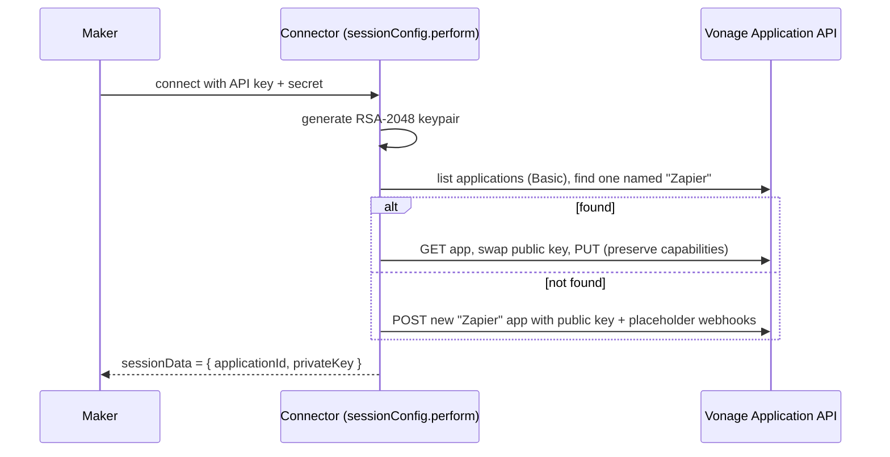

# Architecture

This connector is a self-contained Zapier Platform (CLI) integration. There is no external middleware: because the Zapier Platform runs the connector's JavaScript at connect time (`sessionConfig.perform`), before every request (`beforeRequest`) and after every response (`afterResponse`), all the credential and webhook management that the [Power Automate sibling](https://github.com/aficcion/vonage-pa-trigger) delegates to a hosted middleware lives here, inside the connector.

## Session authentication

The maker supplies only an **API key** and **API secret** (`authentication.js`). The connector uses `type: 'session'`: on connect — and again whenever a refresh is triggered — `getSessionKey` runs and returns extra `sessionData` that the rest of the connector relies on.

`applicationId` and `privateKey` are the field names the JWT middleware and the actions already read from `bundle.authData`, so the Application plumbing stays invisible — the maker only ever sees "API key / API secret". The connection is verified by a balance call (`testAuth`).

## The managed Vonage Application

- **Find-or-create by exact name `Zapier`.** The connector reuses an Application named `Zapier` if one exists, otherwise creates it. It never touches any other Application the maker owns.
- **One public key per Application.** Vonage allows a single public key per Application. Sharing one Application across integrations (e.g. this connector *and* the Power Automate connector) would cause key wars: each side's key rotation invalidates the other's JWTs. A dedicated `Zapier` Application avoids that.
- **GET-merge-PUT.** Registering a key always reads the full Application first and PUTs it back with only `keys` swapped. A PUT without `capabilities` would drop the webhooks active Zaps depend on; a PUT without `keys` would unregister the public key and break JWT auth.

## Signing and self-healing

`jwt_middleware.js` provides two middlewares wired in `index.js`:

- **`addJwtToBundle` (`beforeRequest`).** When `applicationId` + `privateKey` are present, it mints an RS256 JWT (15-minute expiry, random `jti`, `application_id` claim) and attaches it as `bundle.authData._jwt`. It also patches the literal `"Bearer undefined"` that Zapier interpolates into the first request of an invocation before this middleware runs. With no Application data (an SMS-only setup) it passes through untouched.
- **`refreshOnInvalidJwt` (`afterResponse`).** A `401` on a `Bearer`-authenticated request means the registered public key no longer matches the private key (rotated/overwritten outside the connector). Throwing `RefreshAuthError` makes Zapier re-run the session exchange — which **re-registers a fresh keypair** — and retry. That re-registration *is* the self-healing.

### Chat-channel 401s are not refreshed

A `401` on a chat-channel send (WhatsApp/RCS/etc.) usually means the **sender isn't linked** to the connector's Vonage Application — a new keypair won't fix that, and a blind refresh-retry would surface as a cryptic "halted execution". Chat sends therefore tag their request with an `X-Connector-Chat-Channel` header; `refreshOnInvalidJwt` detects it and raises a clear, actionable error instead of refreshing.

## Webhook hygiene

Triggers are REST hooks: enabling a Zap subscribes a webhook, disabling it unsubscribes. Two shared modules implement the subscribe/unsubscribe pairs:

- **`app_webhooks.js`** — for webhooks that live on the Vonage **Application** (Messages `inbound_url`/`status_url`, Voice `event_url`, Verify `status_url`). Uses Basic auth (the Application API accepts it for reads and updates, so no JWT is needed to manage webhooks).
- **`account_settings.js`** — for **account-level** callbacks (legacy SMS `moCallBackUrl` / DLR `drCallBackUrl`) via the Account Settings API.

Both follow the same rules:

- **Warn, don't clobber.** If a slot already holds a URL that isn't ours and isn't an obvious placeholder (Vonage's own `example.com`/sample NCCO), it belongs to another integration. Subscribing refuses to overwrite it unless the maker ticks **"Take over the webhook"**. The displaced URL is captured in `subscribeData` and restored on unsubscribe.
- **One Zap per slot.** An Application has one address per webhook slot, so only one Zap at a time can own a given `(capability, hook)`; the most recently enabled Zap wins. This is documented rather than worked around.

## Comparison with the Power Automate connector

| | Zapier (this repo) | [Power Automate](https://github.com/aficcion/vonage-pa-trigger) |
|---|---|---|
| Can run code | Yes (Platform JS) | No (declarative connector) |
| App/key/JWT management | Inside the connector (`authentication.js`, `jwt_middleware.js`) | In an external VCR middleware |
| Webhook subscription | Inside the connector (`app_webhooks.js`) | In the middleware |
| Managed app name | `Zapier` | `Power Automate` |

The two are deliberate mirrors of one another; the design lessons (one key per app, GET-merge-PUT, foreign-URL protection, chat-channel 401 handling) are shared.
